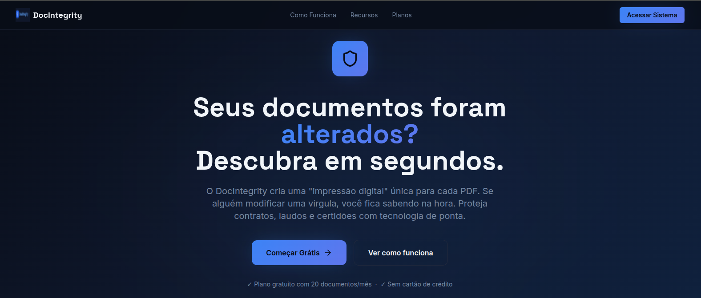
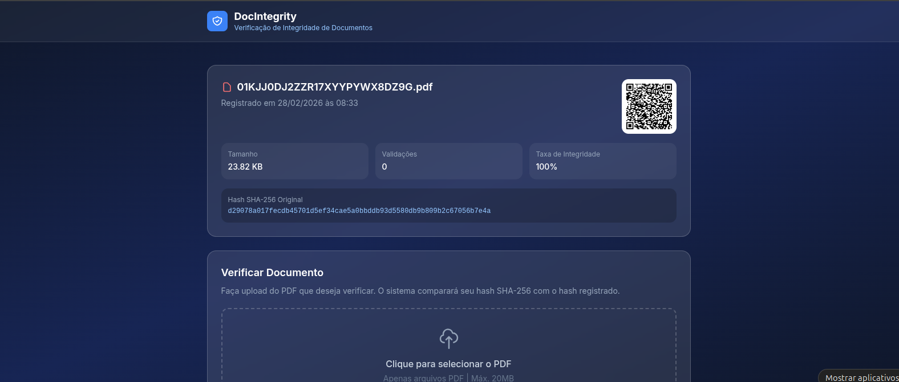
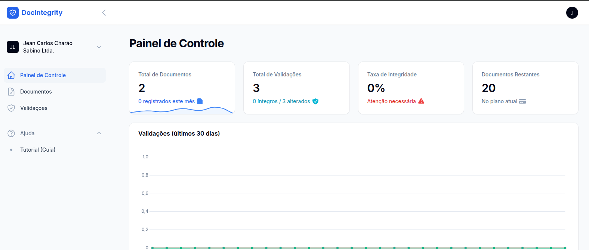

# 📄 DocIntegrity — Validação de Integridade de Documentos

O **DocIntegrity** é uma plataforma SaaS desenvolvida para garantir a integridade de documentos digitais através de hashing criptográfico (SHA-256).

A solução permite registrar documentos, gerar uma “impressão digital” única e validar posteriormente se o arquivo foi alterado.

---

## 🎯 Objetivo

Garantir autenticidade e integridade de documentos digitais, permitindo:

* detectar alterações em arquivos
* validar documentos publicamente
* fornecer rastreabilidade de validações
* oferecer segurança como serviço (SaaS)

---

## ⚙️ Principais funcionalidades

### 📄 Registro de documentos

* upload de arquivos PDF
* geração de hash SHA-256
* armazenamento de metadados
* geração automática de QR Code

---

### 🔍 Validação de integridade

* upload de documento para comparação
* verificação baseada em hash
* resultado imediato (íntegro ou alterado)
* histórico de validações

---

### 🌐 Verificação pública

* link único por documento (`/verify/{token}`)
* validação sem necessidade de login
* compartilhamento via QR Code

---

### 🧠 Multi-tenant (SaaS)

* isolamento por empresa (tenant)
* usuários vinculados ao tenant
* controle de uso por plano

---

### 📊 Dashboard e relatórios

* total de documentos registrados
* total de validações realizadas
* taxa de integridade
* consumo do plano

---

### 🔌 API REST

* autenticação via Laravel Sanctum
* endpoints para documentos e validações
* isolamento por tenant
* documentação OpenAPI (/docs/api)

---

## 🧠 Diferenciais técnicos

* 🔐 **Hash criptográfico SHA-256**
* 🌐 **Validação pública sem autenticação**
* 🧩 **Arquitetura multi-tenant**
* 📊 **Métricas de integridade**
* 🔗 **QR Code automático para validação**
* ⚙️ **API completa para integração**

---

## 🏗️ Arquitetura

* **Backend:** Laravel 11
* **Admin:** FilamentPHP 3
* **Banco:** MySQL
* **Cache / Queue:** Redis
* **Infra:** Docker / Nginx
* **Auth API:** Laravel Sanctum

📄 Detalhes técnicos: [Arquitetura do sistema](./docs/arquitetura.md)

---

## 🔄 Fluxo do sistema

1. Usuário registra documento
2. Sistema gera hash SHA-256
3. Documento recebe token público
4. QR Code é gerado automaticamente
5. Usuário compartilha link de verificação
6. Outro usuário envia arquivo para validação
7. Sistema compara hashes
8. Resultado é exibido (íntegro ou alterado)

---

## 📸 Demonstração

<h3 align="center">Landing Page</h3>

  

<h3 align="center">Verificação Pública</h3>

  

<h3 align="center">Dashboard</h3>

  

---

## 🔗 Acesso

👉 https://docintegrity.jeancarlos.com.br

---

## 🚧 Status

Projeto funcional com foco em segurança, escalabilidade e integração.

---

## 👨‍💻 Autor

Jean Carlos Charão Sabino
🔗 https://jeancarlos.com.br
🔗 https://www.linkedin.com/in/jeancarloscharaosabino/
